  <h1>Hi! I'm Gabriel Oliveira! 👋</h1>
  <h3>QA & PM Intern | Front-end Enthusiast | Student</h3>
  

  

 

<table align="center">
  <tr>
    <td valign="top" width="50%">
- 🔭 I’m currently working on QA, PM and Front-end Development.
  
- 🌱 Currently learning Business Rules & TypeScript.
  
- 👯 Looking to collaborate on smaller-scale projects that offer a lot of space for learning.
   
- 🤔 Focused on improving my skills in JavaScript & C ( I’m an newly intern and a student in this field).
  
- 😄 Pronouns: He/Him
  
- 📫 How to reach me: 

 
  
   
  

  </td>
    <td valign="top" width="50%">
      

        
         
      

    </td>
  </tr>
</table>

##

  
  

##

<picture>
  <source media="(prefers-color-scheme: dark)" srcset="https://raw.githubusercontent.com/NerialSumber/NerialSumber/output/github-contribution-grid-snake-dark.svg">
  <source media="(prefers-color-scheme: light)" srcset="https://raw.githubusercontent.com/NerialSumber/NerialSumber/output/github-contribution-grid-snake.svg">
  
</picture>

